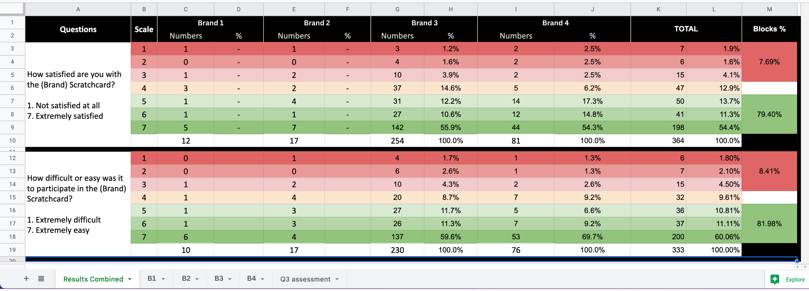
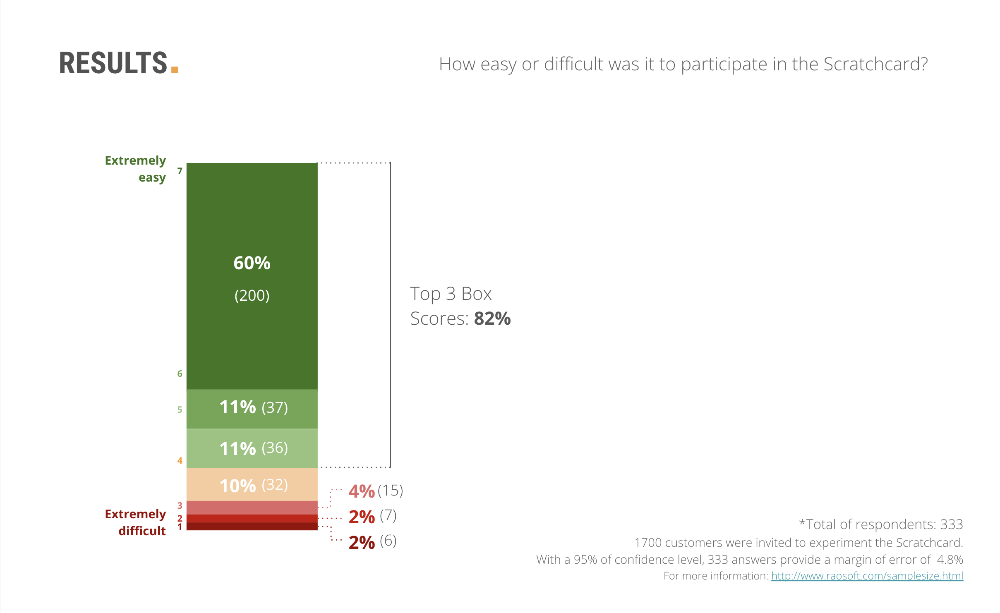

# Random Rewards Proof of Concept  
## Behavioral and Survey Analysis (UX Research Case Study)

## Overview

This repository documents a UX research and behavioral analysis project conducted as part of a real-world Proof of Concept (POC) for a digital rewards feature in an online gaming platform.

The study evaluated customer satisfaction and perceived usability of a Scratchcard-style reward experience, using survey data collected immediately after users completed the flow.

Due to confidentiality constraints, original datasets, full slide decks, and proprietary brand details cannot be shared. This repository focuses on methodology, analytical reasoning, and selected visual artefacts used to support product and commercial decision-making.


## Project Context

The Engagement and Commercial teams were exploring a new rewards feature that allowed customers to participate in short games to receive prizes.

To assess feasibility and customer response, a Proof of Concept was launched using a third-party provider, limited to selected customer segments within the same organization.

The UX Research goal was to gather fast, actionable feedback under real product constraints, rather than to run a fully controlled experiment.


## Research Goals

- Understand overall customer satisfaction with the Scratchcard experience  
- Evaluate perceived ease or difficulty of participation  
- Capture qualitative feedback to contextualize quantitative results  
- Support product iteration and commercial decision-making  


## Methodology

- Method: On-site survey (Hotjar)  
- Timing: Triggered immediately after the user completed the reward flow  
- Devices: Mobile and desktop  
- Participants: Customers invited to the Proof of Concept  
- Scale: 7-point Likert scale + open-ended question  

### Survey Questions

1. How satisfied are you with the Scratchcard?  
   (1 = Not satisfied at all, 7 = Extremely satisfied)

2. How easy or difficult was it to participate in the Scratchcard?  
   (1 = Extremely difficult, 7 = Extremely easy)

3. Please tell us your impressions of the Scratchcard  
   (Open-ended)


## Limitations and Biases

- All participants won a prize, which likely influenced satisfaction scores  
- The survey could only be shown to users who:
  - Entered the game  
  - Completed the full flow  
  - Returned to the website  
- Customers who dropped off early were not captured  
- Short timelines limited the ability to run follow-up qualitative research  

These constraints were explicitly acknowledged when interpreting results.


## My Role

I acted as the primary UX Researcher on this project.

Responsibilities included:
- Aligning research goals with stakeholders  
- Designing the research plan and survey questions  
- Implementing and launching the survey  
- Coordinating technical constraints with the optimisation team  
- Analyzing quantitative and qualitative results  
- Synthesizing insights and presenting findings to stakeholders  


## Teams Involved

- Engagement Team: Feature owners and stakeholders  
- Commercial Team: POC sponsors and decision-makers  
- UX Research: Study design and analysis (single researcher)  
- Optimisation Team: Survey triggering and technical setup  


## Key Results (Illustrative Artefacts)

**Note:**  
The images below are extracts from internal presentation materials.  
Brand names and company identifiers have been anonymized.  
Audience labels represent different customer segments within the same organization, not separate companies.

### Satisfaction Results by Brand Segment



Aggregated satisfaction distribution across four customer segments (Brands 1-4).


### Ease of Participation Results



Perceived ease of participation showed consistently positive results across segments.


## Insights and Impact

Quantitative results showed high overall satisfaction and ease of use across all segments.

Qualitative feedback revealed two recurring sources of confusion:
- What exactly had been won  
- Where and how prizes could be redeemed  

These insights informed:
- Clearer prize communication in the user flow  
- Design considerations for a future integrated rewards feature  
- Commercial evaluation of the third-party provider partnership  


## Learnings

### Prioritisation Focused on Business Value

Despite methodological limitations, the study delivered actionable insights that influenced real product decisions.

### Manual Coding of Open-Ended Responses

Transforming qualitative feedback into structured themes helped stakeholders better understand why users responded the way they did.


## Notes on Data and Confidentiality

- No raw datasets are included in this repository  
- Brand names, company identifiers, and proprietary visuals have been anonymized  
- All artefacts are shared for portfolio and illustrative purposes only  


## Repository Structure
```text
random-rewards-poc/
├── README.md
└── assets/
    ├── random_rewards_1.png
    ├── random_rewards_2.png
    ├── random_rewards_3.png
    ├── random_rewards_4.png
    ├── random_rewards_5.png
    └── random_rewards_6.png

## About This Repository

This repository demonstrates research thinking, analytical reasoning, and communication skills rather than serving as a reproducible data analysis project.

For a narrative walkthrough, see the corresponding case study on [datascienceportfol.io/paulafrossard/projects](https://www.datascienceportfol.io/paulafrossard/projects/2)
